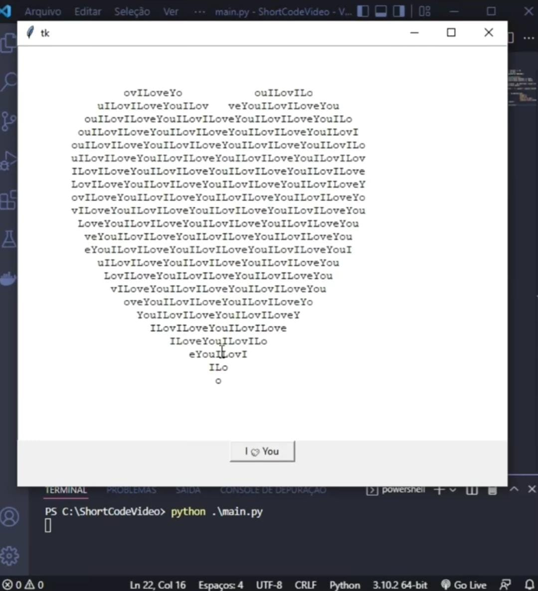

# Algoritmo "I Love You" com Tkinter

Este repositório contém um simples algoritmo em uma única linha em Python que utiliza a biblioteca Tkinter para criar uma janela que exibe a mensagem "I Love You". 


## Funcionamento

O algoritmo utiliza o poder do Tkinter para criar uma interface gráfica básica. A mensagem "I Love You" é gerada por meio de um algoritmo de desenho de texto artístico em uma única linha. Quando o botão "I Love ❤️ Yo" é clicado, a mensagem é exibida na janela de texto.

## Demonstração no TikTok

Este algoritmo foi compartilhado no TikTok como parte de um vídeo curto de programação criativa. Você pode assistir ao vídeo para ver o funcionamento do algoritmo em ação e aprender mais sobre o desenvolvimento dele.

[Assista ao vídeo no TikTok](https://www.tiktok.com/usuario/seuusuario/linkdovideo)

## Como Usar

1. **Clone ou faça o download deste repositório**:
   - Para clonar o repositório com Git, use o seguinte comando:
     ```
     git clone https://github.com/bjsneto/draw_i_love_you.git
     ```
   - Se preferir, você pode fazer o download do repositório como um arquivo ZIP. Basta clicar no botão "Code" no topo desta página e selecionar "Download ZIP".

2. Execute o script Python `main.py`.

3. Clique no botão "I Love You" para ver a mensagem.

Sinta-se à vontade para explorar e personalizar o código conforme desejar.

Espero que este algoritmo lhe traga diversão e inspiração para suas próprias criações. Divirta-se programando!
